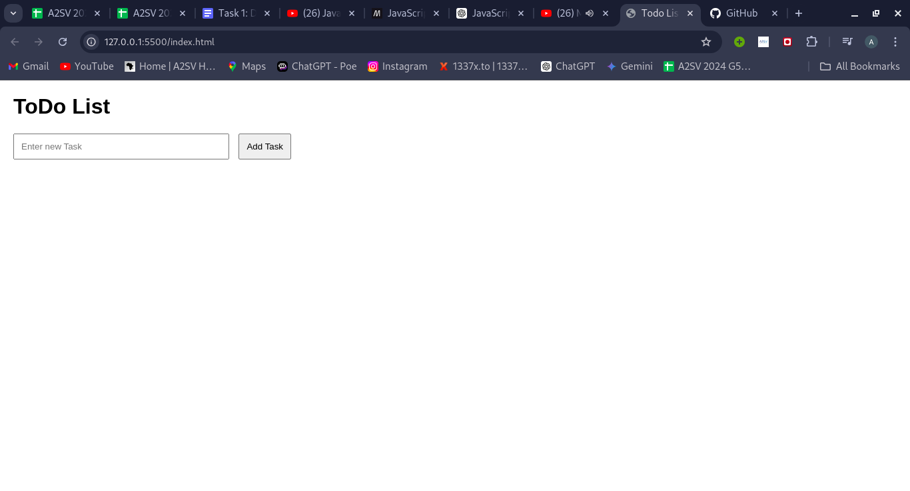

# Todo List Application

This is a simple Todo List application built using HTML, CSS, and JavaScript.

## Features

- Add tasks to the list
- Edit tasks in the list
- Remove tasks from the list

## How to Run

1. Clone the repository:
   ```sh
   git clone https://github.com/Abdidawud/todo-list-app.git
   ```
2. Navigate to the project directory:
   ```sh
   cd todo-list-app
   ```
3. Open `index.html` in your browser.

## Screenshot and Description

At first when entering to the link it shows text field area that ready to take a task and a button going to be hit after entering the task

After adding several tasks the page would look like this.


When someone need to update or edit the list entered can hit the button edit that showed.


And a person can change the list like this.


This will be the screen will be showed after editing.


Again if someone wants to remove some task from the list can hit the button remove and as you can see the task will be removed.

